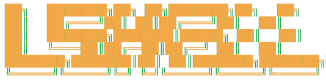

<div align="center">



**English** · [简体中文](README.zh-CN.md)

A development terminal that runs **locally on iOS** — the first on-device implementation of **Claude Code**, and a complete dev environment: git, npm, Python, SSH, and an AI CLI, all in one process.

### ★ Highly recommended — take the live tour

[](https://ikunluo3-bit.github.io/l-shell-ios/)

**An interactive, themed page** — a live in-page terminal, the full command list, and the architecture. The fastest way to see what L Shell does. <sub>(source in [`docs/`](docs/))</sub>

<br>


</div>

---

L Shell embeds real language runtimes **as ARM64 machine code, in-process** — V8, CPython and OpenSSL — inside [nodejs-mobile](https://github.com/nodejs-mobile/nodejs-mobile) (jitless V8). No emulation, no WebAssembly, no remote shell, no jailbreak. The official Claude Code CLI runs unmodified in the same process, with its Bash tool calling the ~90 coreutils, git/npm/pip, and the SSH suite that also live on-device.

## Table of Contents

- [Why L Shell](#why-l-shell)
- [Capabilities](#capabilities)
- [Architecture](#architecture)
- [Install](#install)
- [Build from source](#build-from-source)
- [Repository layout](#repository-layout)
- [Limits](#limits)
- [Roadmap](#roadmap)
- [Security & privacy](#security--privacy)
- [Contributing](#contributing)
- [License](#license)
- [Credits](#credits)

## Why L Shell

Two things make it worth a look.

**1. The first on-device Claude Code.** Every other "Claude Code on a phone" is a remote shell into a server. L Shell runs the actual CLI on the device — offline-capable, your files stay local.

**2. A complete, native dev environment.** Not a toy shell: real `git` (24 subcommands), `npm`, `python3` (embedded CPython), `pip`, a full SSH suite, and ~90 coreutils — the same tools the AI's Bash tool drives.

Under iOS's constraints, every terminal project picks a lane. L Shell chose native runtimes in-process — here is how that compares, honestly:

| Approach | Projects | Strengths | Trade-offs |
| --- | --- | --- | --- |
| **Native, in-process** | **L Shell** | Real Node / Python ecosystems; the AI CLI runs on-device; fully offline | Can't run external binaries; JS runs without JIT |
| x86 user-mode emulation | iSH | Full Alpine / apk ecosystem; the closest thing to real Linux semantics | Per-instruction translation costs speed |
| WASM + native ports | a-Shell | Mature, deep system integration (Shortcuts / Files), ships heavyweights like TeX | No Node / npm ecosystem |
| Remote-first clients | Blink · Termius | The benchmark for remote work (mosh, multi-device roaming) | The device itself runs no code |

> Based on each project's public docs. Four approaches for different needs — none strictly better. L Shell goes native so the AI CLI and real ecosystems can live on the device.

<div align="right"><a href="#table-of-contents">↑ top</a></div>

## Capabilities

| Area | What's there |
| --- | --- |
| **Runtimes** | `node` (Node 18.19.1) · `git` (isomorphic-git, 24 subcommands, HTTPS + token) · `npm` (in-process installer) · `python3` (CPython 3.13.14, 153 stdlib + 68 C extensions) · `pip3` (pure-Python wheels) |
| **SSH suite** | `ssh` · `sshpass` · `ssh-keygen` · `ssh-copy-id` · `scp` · `sftp` — one-shot commands, a live interactive remote terminal (vim / top / tmux), key & password auth, 2FA, `~/.ssh/config`, ProxyJump |
| **~90 coreutils** | `grep rg sed awk jq yq curl wget tar find sort …` via [just-bash](https://www.npmjs.com/package/just-bash) + device fills |
| **AI CLI** | `claude` (official Claude Code, unmodified) · Gemini CLI & iFlow verified running (not preinstalled) |

**[→ Full interactive tour](https://ikunluo3-bit.github.io/l-shell-ios/)** — an on-page live terminal, the complete command list, and the architecture, in a themed capabilities site.

<div align="right"><a href="#table-of-contents">↑ top</a></div>

## Architecture

```
┌─ iOS App (SwiftUI + SwiftTerm) ──────────────────────────────┐
│  Terminal emulator  ── bytes ⇅ ──  NodeRunner (pipes + dup2)  │
│                                                               │
│  nodejs-mobile · V8 (Node 18.19.1, jitless)      [ARM64]      │
│    ├─ just-bash · ~90 coreutils                  [pure JS]    │
│    ├─ isomorphic-git · npm · ssh2                [pure JS]    │
│    ├─ N-API bridge → CPython 3.13 (68 .so)       [ARM64]      │
│    └─ node:crypto → OpenSSL 3                     [ARM64]      │
│                                                               │
│  Claude Code 2.1.112 (unmodified) ── Bash tool ──▶ the above  │
│  HOME / workspace → app Documents (visible in Files.app)      │
└───────────────────────────────────────────────────────────────┘
```

Three iOS hard constraints, and how L Shell answers each:

1. **No `fork`/`exec`** (can't launch external binaries) → `preload/shims/child_process.js` intercepts every `node:child_process` call and routes it to in-process implementations (`bash`→just-bash, `git`→isomorphic-git, `ssh`→ssh2, …).
2. **Jitless V8 — no JIT, and therefore no WebAssembly** → `fetch` is rewritten over `node:https` (no undici/llhttp.wasm); every dependency is pure-JS or native; ssh2's poly1305 WASM is replaced with a pure-JS stub.
3. **A single Node instance that can't restart in-process** → `process.exit` becomes a catchable `SessionExit`; switching containers restarts the app for guaranteed isolation.

<div align="right"><a href="#table-of-contents">↑ top</a></div>

## Install

A prebuilt **`LShell.ipa`** is attached to each [**Release**](../../releases/latest). It is **development-signed**, so it won't install as-is on a device that isn't in its provisioning profile. Two honest paths:

**Option 1 — Sideload the IPA.** Download `LShell.ipa` from the Releases page, then re-sign it with your own Apple ID using a sideloading tool such as [AltStore](https://altstore.io) or [Sideloadly](https://sideloadly.io). A free Apple ID works (the app resigns every 7 days); a paid Developer account removes that limit.

**Option 2 — [Build from source](#build-from-source)** in Xcode with your own signing team.

**First run.** On launch, sign in with your Claude account, or configure a third-party Anthropic-compatible API endpoint + key. Set an HTTPS proxy if your network needs one. Your workspace lives in the app's Documents folder (visible in Files.app).

<div align="right"><a href="#table-of-contents">↑ top</a></div>

## Build from source

This repo ships the **source only**. Large prebuilt binaries and third-party code are fetched separately (see [`.gitignore`](.gitignore)). You'll need macOS + Xcode.

```bash
# 0. tools
brew install xcodegen

# 1. JS deps + vendored Claude Code (2.1.112)
cd node-runtime && npm install
npm pack @anthropic-ai/claude-code@2.1.112
mkdir -p vendor/claude-code && tar -xzf anthropic-ai-claude-code-2.1.112.tgz -C vendor/claude-code --strip-components=1
cd ..

# 2. prebuilt frameworks → ios/Frameworks/  (large; obtain from upstream)
#    • NodeMobile.xcframework — Node 18.19.1 iOS build (small-icu):
#        https://github.com/1Conan/nodejs-mobile
#    • Python.xcframework — BeeWare Python-Apple-support 3.13:
#        https://github.com/beeware/Python-Apple-support/releases
#    (only the ios-arm64 slice is needed to build for a device)

# 3. bundle the runtime + Python, generate the Xcode project
cd ios
bash scripts/bundle-runtime.sh
bash scripts/bundle-python.sh
xcodegen generate

# 4. open, pick your signing team, run to a device
open ClaudeTerminal.xcodeproj
```

Two build configurations coexist on-device: **Debug** = `L Shell Dev` (`…claudeterminal.dev`), **Release** = `L Shell` (`…claudeterminal`).

<div align="right"><a href="#table-of-contents">↑ top</a></div>

## Repository layout

```
ios/                         iOS app (SwiftUI + SwiftTerm)
  ClaudeTerminal/*.swift       app, terminal view, NodeRunner, settings, CPython bridge
  scripts/*.sh                 bundle-runtime / bundle-python / build & install
  project.yml                  XcodeGen spec (Debug=dev, Release=release)
node-runtime/                JS runtime that ships inside the app
  bootstrap.js                 entry called by NodeRunner's node_start
  shell.js                     the interactive shell (prompt, launch claude/ssh)
  preload/shims/*.js           child_process / fetch / tty / wasm / control shims
  preload/commands/*.js        git · npm · python · pip · ssh suite · coreutils · curl
docs/                        the capabilities website (GitHub Pages)
native-bridge-poc/           native spawn-bridge proof-of-concept (roadmap)
test/                        regression tests
```

<div align="right"><a href="#table-of-contents">↑ top</a></div>

## Limits

Honest platform boundaries — iOS constraints, not bugs. These commands return a clear notice instead of a simulated success:

```
npx  bun  deno  ruby  perl  php  go  rustc  cargo  java  gcc  cc  make
```

iOS forbids `fork`/`exec` (no external binaries) and the jitless runtime has no WebAssembly — each of the above needs one or the other. Files can be created and edited; they just can't run.

Also known: Node 18 is EOL (a Node 22 fork is planned); MCP stdio servers aren't supported (single Node instance); each new Claude session leaks one `cli.js` module (restart the app after many sessions); on-device builds require Xcode signing.

<div align="right"><a href="#table-of-contents">↑ top</a></div>

## Roadmap

Statuses are factual; no timelines promised.

- **`[tested]`** More AI CLIs — Gemini CLI / iFlow already run on device.
- **`[prototype]`** Native spawn bridge + native `grep`/`cat` family — validated in [`native-bridge-poc/`](native-bridge-poc/).
- **`[planned]`** CRuby native port — same embedding pattern as CPython.
- **`[research]`** Userspace PTY — modeled on iSH's tty implementation.

<div align="right"><a href="#table-of-contents">↑ top</a></div>

## Security & privacy

- **API credentials** are stored in the iOS **Keychain**, never in plaintext backups.
- **Session records** (`.claude/`) live in the app's Documents folder — they enter iCloud / computer backups and are visible in Files.app.
- **Use the official Anthropic API or a faithful relay.** An API relay that reverse-proxies another vendor can inject instructions into, or read, your conversations. Prefer the official endpoint; avoid untrusted relays.

<div align="right"><a href="#table-of-contents">↑ top</a></div>

## Contributing

Issues and PRs welcome. Good places to start: the command implementations in `node-runtime/preload/commands/`, the iOS constraints handled in `node-runtime/preload/shims/`, and the native bridge in `native-bridge-poc/`. Keep changes pure-JS / jitless-safe (no WebAssembly, no `fork`/`exec`), and match the surrounding style.

<div align="right"><a href="#table-of-contents">↑ top</a></div>

## License

Released under the [MIT License](LICENSE).

The vendored **Claude Code** (pinned 2.1.112, under `node-runtime/vendor/`, fetched at build time) is Anthropic's own software and remains under Anthropic's terms — it is not covered by this project's license.

<div align="right"><a href="#table-of-contents">↑ top</a></div>

## Credits

Built on the work of [nodejs-mobile](https://github.com/nodejs-mobile/nodejs-mobile) · [CPython / BeeWare Python-Apple-support](https://github.com/beeware/Python-Apple-support) · [isomorphic-git](https://github.com/isomorphic-git/isomorphic-git) · [just-bash](https://www.npmjs.com/package/just-bash) · [ssh2](https://github.com/mscdex/ssh2) · [SwiftTerm](https://github.com/migueldeicaza/SwiftTerm) · and Anthropic's [Claude Code](https://github.com/anthropics/claude-code).

<div align="right"><a href="#table-of-contents">↑ top</a></div>
